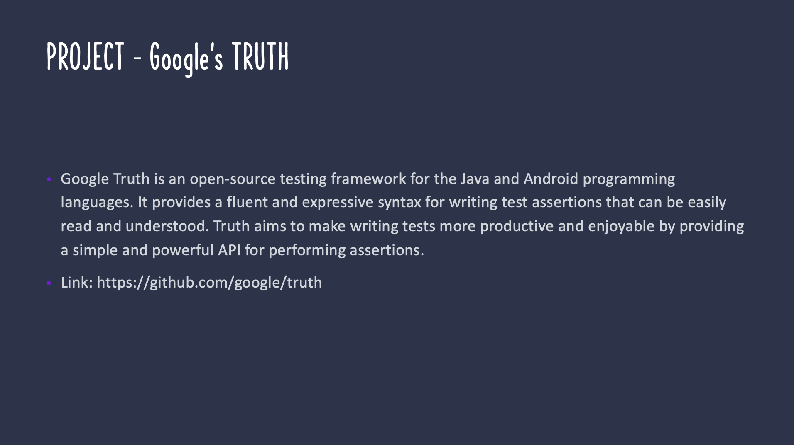
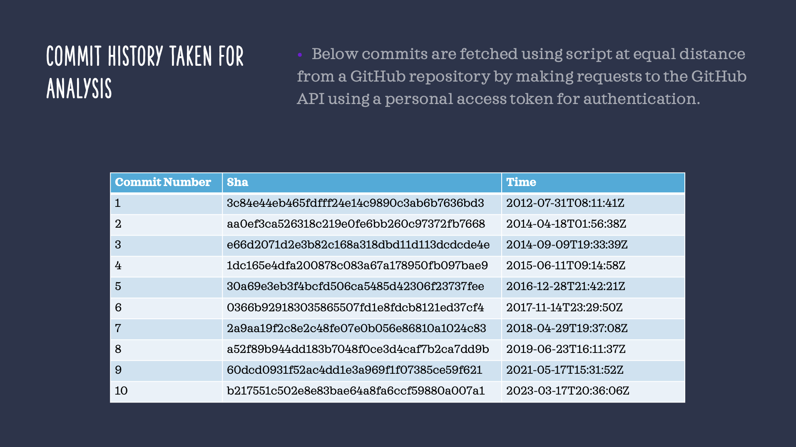
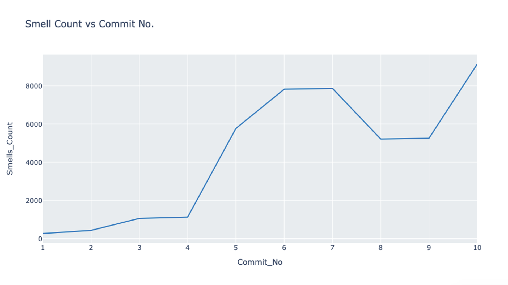
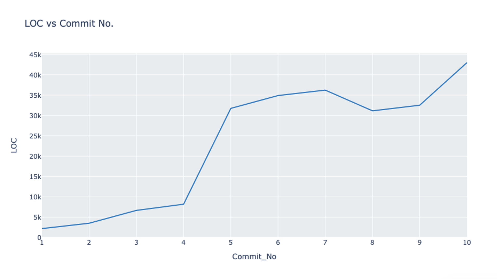
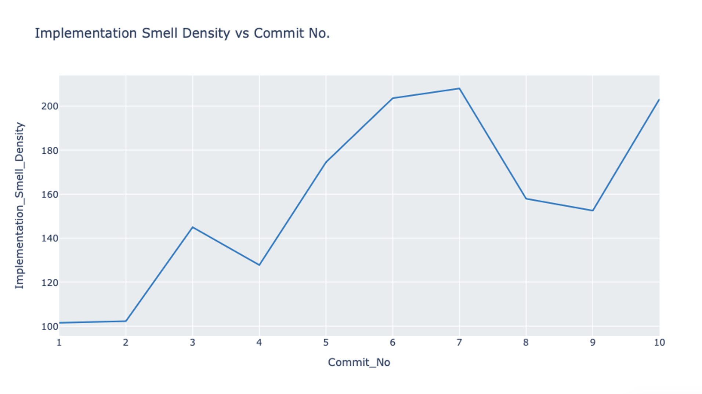
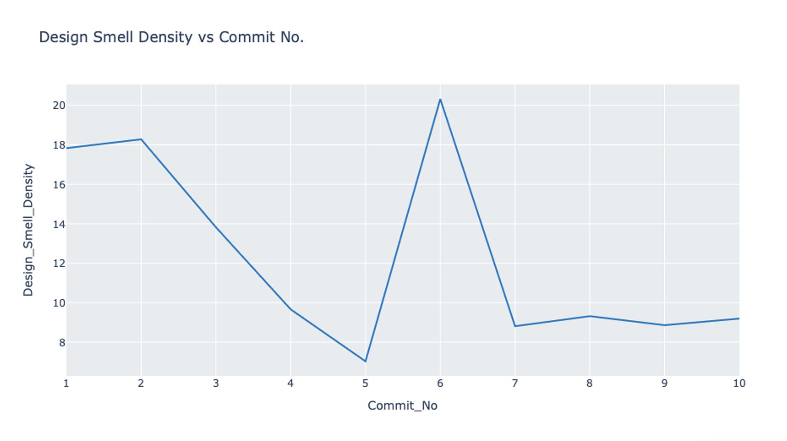
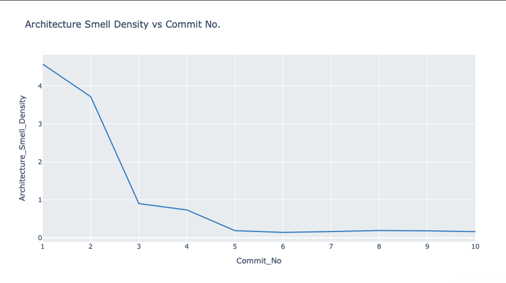
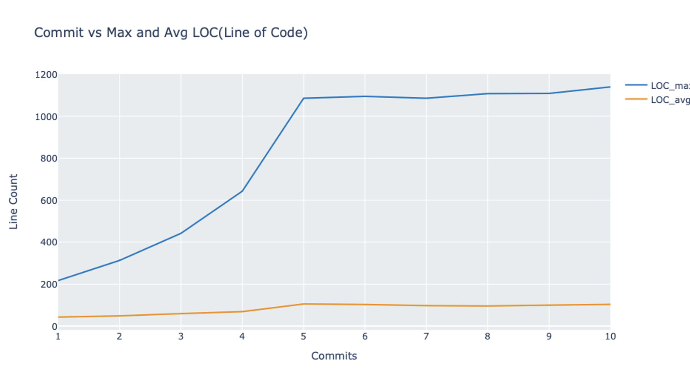
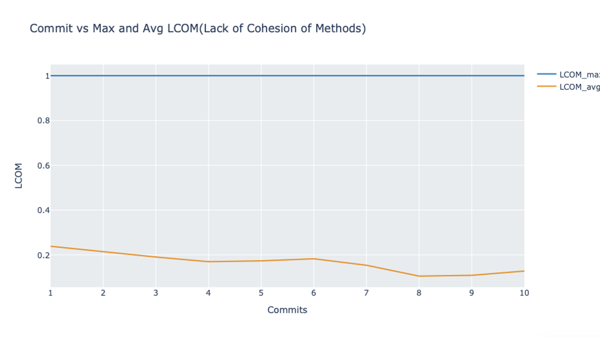
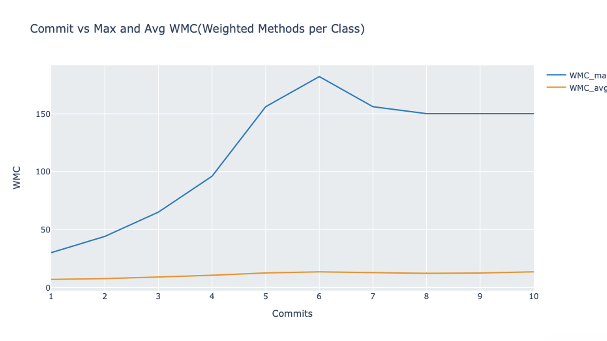

## Expectations

- Choose a well-known Java open-source project from GitHub.
- Carry out a software design assessment for the project using DesigniteJava. You need to choose at least ten different commits spread across the project's life. It is expected that you choose these commits (based on their commit-time) almost equal distance with each other.
- The assessment must include a plot between LOC and the total number of smells (both at Y-axis) versus commits (to see how LOC and the total number of smells are changing from each commit).
- The assessment must include plots between smell density (for each implementation, design, and architecture) smells and corresponding commits. Smell density is computed as follows (for implementation smells):
smell density (implementation smells) = (total implementation smells *1000)/total LOC in the project
- The assessment must include plots between commits (X-axis) and metrics (maximum and average metrics for the following metrics: LCOM, WMC, and class LOC) at Y-axis. Please note that you must not include -1 (especially with LCOM) in your max/average computation because it reflects the tool could not compute the metric for that class.

## Deliverables

